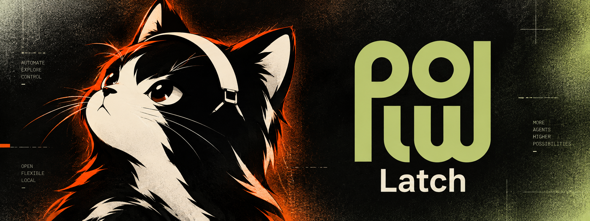
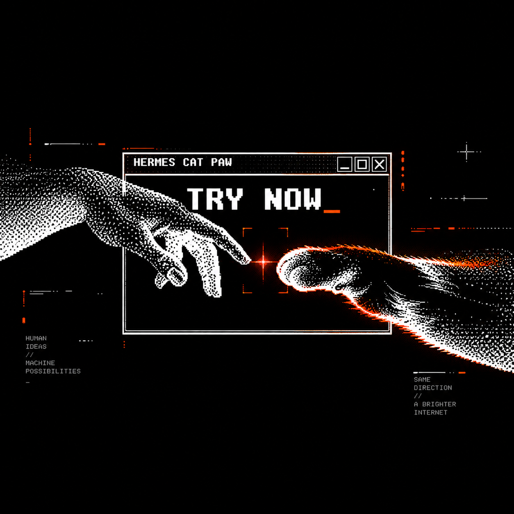

<p align="center">
  
</p>

# Cat Paw Latch

## Your AI can act. You stay in control.

Cat Paw Latch lets a remote AI agent — Claude Code or any MCP client — use the
computer you own: read and write files, run commands, and drive a real browser.
Every operation is approved by you before it runs.

It is the Windows, Linux, and macOS fork of
[Plow Latch](https://github.com/plow-pbc/latch). The approval model, the
capability-derived sandbox, and the audit trail are the upstream design. This
fork adds native hardening and packaging for Windows 11 and Linux.

> **Private by design.** Your computer connects out to Plow; nothing listens on
> your network. Credentials never leave the device and never appear in a URL, a
> log, or the audit trail.

---

## Try it now.

<p align="center">
  <a href="https://github.com/kumanaya/hermes-cat-paw">
    
  </a>
</p>

Cat Paw Latch is the device side of
**[Hermes Cat Paw](https://github.com/kumanaya/hermes-cat-paw)** — the complete,
ready-to-run setup that connects your AI to the computer you own.

**[Try Hermes Cat Paw →](https://github.com/kumanaya/hermes-cat-paw)**

---

## Autonomy needs a brake.

AI can click through a browser, run a command, and touch the systems where your
real life happens. The dangerous failure is not an agent that cannot act. It is
an agent that acts without you seeing what changed.

Cat Paw Latch makes approval part of the workflow:

- **See the action before it happens.** Every operation becomes a concrete intent, decided on your machine.
- **Approve the capability, not a vague promise.** Answer every time, or keep a rule for one exact, repeatable action.
- **A past "yes" is not a permanent yes.** A saved rule is a hint; it never widens a permission.
- **A stop is a stop.** Denial, timeout, or a dropped connection ends the flow — the agent does not route around it.
- **Verify, then report.** A successful call is not proof the outcome happened; the agent checks what it can.

## The connection between intent and action.

Your computer dials *out* to the Plow relay. The relay authenticates the agent
and forwards its requests to this app, which is the only place that can approve
or refuse them. There is no inbound port to open and no public address to
expose. Agents reach machines this way today.

Everything an agent can reach is scoped to its identity: open requests,
finished results, and saved rules all key on who asked.

## Built for the desktop you actually use.

| Platform | Sandbox | Secrets | Presence |
| --- | --- | --- | --- |
| **macOS** | Seatbelt profile derived from the approved capabilities | Keychain | Touch ID |
| **Windows 11** | Job Object + AppContainer workspace | Credential Manager / DPAPI | Windows Hello |
| **Linux** | Bubblewrap + staged workspace (systemd TasksMax) | Secret Service | Session unlock |

## Security is not a checkbox.

| What is protected | How the boundary works |
| --- | --- |
| **Who is acting** | The relay authenticates the agent. Requests, results, and rules are scoped to that identity. |
| **What is allowed** | Acting operations pass a device-local capability decision and your approval policy. |
| **Where data lives** | Vault data stays on the device. An agent may request an approved use; the secret is never returned to it. |
| **How the device is reached** | The connection is outbound only. Relay credentials are redacted from logs. |
| **What changed** | Paths are resolved before you see them, and every decision is written to an append-only audit log. |

The macOS command sandbox allows broad reads under the owner's home directory,
so a shell approval is a high-trust decision; prefer a narrower tool when one
fits, and read the prompt. See
[docs/SANDBOX-BOUNDARY.md](docs/SANDBOX-BOUNDARY.md).

## Run it from source.

There are no binary downloads — Cat Paw Latch is built from this repository.
That is deliberate: this fork is not an official Plow build, so it ships no
signed installer. A checkout is the whole install.

### Before you start

- **Node.js 22 or newer**, and npm.
- **Git**, and [`just`](https://github.com/casey/just) — `brew install just` on
  macOS, `cargo install just` or your package manager elsewhere.
- A native toolchain, so the platform addons compile:
  - **macOS** — Xcode Command Line Tools (`xcode-select --install`).
  - **Windows** — Visual Studio Build Tools, with the Desktop C++ workload.
  - **Linux / Omarchy** — a C++ toolchain, `bubblewrap`, and `python3`.
    On Arch/Omarchy: `sudo pacman -S --needed base-devel just git python bubblewrap fuse2`.
- **Python 3** (the browser runtime is unpacked with it).

### Build and launch

```sh
git clone https://github.com/kumanaya/cat-paw-latch.git
cd cat-paw-latch
just install      # npm install, then download Electron if npm skipped it
just app          # build, then launch the desktop app
```

`just install` is the first-run floor: npm 11 can skip Electron's postinstall,
and without the binary `just app` never opens. On Linux it also rebuilds the
bubblewrap addon if it is missing, and refuses to proceed without `bwrap` on
PATH. From-source state lives under Electron's appData — `~/.config/Plow-Latch-<branch>`
on Linux, `%APPDATA%\Plow-Latch-<branch>` on Windows,
`~/Library/Application Support/Plow-Latch-<branch>` on macOS. A packaged
AppImage uses the unsuffixed `~/.config/Plow-Latch` home instead; build one
with `just package-linux` (needs FUSE 2 to run).

The app opens on its first-run flow. Sign in, keep it running, and connect it to
an agent — the app dials out to Plow, so nothing needs to listen on your
network.

### Enable the browser tools

The file and command tools work as soon as the app runs. The bundled browser and
the vendored provider CLI are fetched separately, once:

```sh
just fetch-vendored    # the pinned gog CLI
just fetch-browser     # Camoufox + fingerprint pool (~320 MB)
```

Run the suite with `just test`, and `just` with no arguments to list every
recipe.

## Inside the repository.

| App / package | Role |
| --- | --- |
| `apps/desktop` (Cat Paw Latch) | Electron app: runs the device core, approval windows, rules, audit, and settings. |
| `packages/protocol` | Canonical JSON, Ed25519 identity, capabilities, intents, grants, rule keys. |
| `packages/transport` | The connection seam and the outbound WebSocket client. |
| `packages/device-core` | The decision and execution path: policy engine, sandboxed executor, file ops, browsing, audit log. |
| `packages/mcp-server` | The MCP server this machine serves: tool surface, capability construction, deferred results. |
| `packages/relay-client` | Dials the Plow relay and serves the exchanges it tunnels. |
| `packages/browser-server` | The Camoufox browser server (TypeScript over playwright-core). |
| `packages/native-*` | Platform addons: Keychain, Credential Manager, Job Object, Bubblewrap, secret-file ACLs. |

The app ships and brands itself as Cat Paw Latch; the codebase and package
scope remain `domo` (`@domo/*`, `DOMO_HOME`), which a rename must not touch.
Deeper documentation lives in [DESIGN.md](DESIGN.md) for the architecture and
[README-ts.md](README-ts.md) for the full layout, build, and testing.

## License

**Apache-2.0. Free to use, change, and share.**

Cat Paw Latch is open source. Use it, modify it, and redistribute it freely —
just keep the license and copyright notices with it. The full text is in
[LICENSE](LICENSE), and the attributions are in [NOTICE](NOTICE).

Copyright 2026 The Plow Collective, Inc.

Cat Paw Latch is a fork of [Plow Latch](https://github.com/plow-pbc/latch).
The original license and copyright cover the code it is built from, and those
notices stay in place here.

### Third-party components

| What | License | Where it lives |
| --- | --- | --- |
| `vendor/browser-server/` | MIT | In this repository |
| Camoufox browser | MPL-2.0 | Downloaded at package time — bundled only in packaged builds |
| camoufox-js | MPL-2.0 | Build-only dependency — does not ship |

### Trademarks

"Plow" and the Plow logo are trademarks of The Plow Collective, Inc. The
license grants no trademark rights, so please don't use them to brand your own
build.

---

**Real autonomy. Visible permission. Your computer stays yours.**
